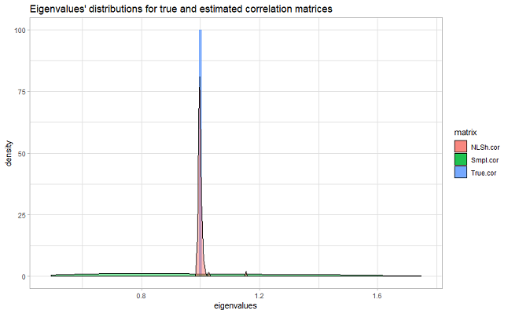

class: animated, fadeIn
## Presentation Outline

- Copulas: **the briefest introduction**

 

--

- **Paper 1**: Shrinkage for Gaussian and t Copulas in UHD .pull-right[.rmk[*jointly with Stanislav Anatolyev*]]

  - Methodology & **main results**

  - **Empirical example**: large portfolio allocation

 

--

- **Paper 2**: Copula-based Combination of (Ultra-)many Forecasts *(proposal)*

---
class: section, center, middle, animated, flipInX
##The briefest introduction into
#Copulas

---
class: animated, fadeIn
##What are copulas?

- Copula is a multivariate CDF with $U[0,1]$ marginals

--

## Why are copulas important?

- **Sklar's theorem**: $F_Y(y_1,...y_p)=C_{F_Y}(F_1(y_1),...F_p(y_p))$

--

  - .rmk[**The converse holds**, too: borrow a copula of one distribution, feed an arbitrary set of marginals to it, and obtain a new multivariate distribution.]

--

- **Copulas**: a very convenient approach to generate flexible multivariate distributions.

---
class: animated, fadeIn
##What is "High-dimensional"?

- **HD**: number of variables $p$ exceeds sample size $n$

--
 

##Copulas & High Dimensionality

 
- **Dimensionality Curse**: in HD, either the existing frameworks are not flexible enough, or estimation is very hard to handle

--

- **Possible solutions**: dimensionality breakdown, structural restrictions, *shrinkage*

---
class: section, center, middle, animated, flipInY
## Paper 1
#Shrinkage for Gaussian and t Copulas
#in Ultra-high Dimensions

---
class: animated, fadeIn
## What we do

- consider Gaussian and t copulas in (U)HD

- use shrinkage estimators of large covariance matrices

- apply the UHD t copula in large stocks portfolio allocation

---
class: animated, fadeIn
##Outline

1. Gaussian and t copulas: motivation and properties

2. Shrinkage estimators

3. Simulation study design and results

4. Empirical example: large portfolio allocation

5. Further research

---
class: animated, fadeIn
###Popular classes of copulas

##Archimedean copulas

.gb[Pro] Have analytical forms and well established properties

.gb[Pro] Easily extendable to HD

.rb[Con] Very rigid: parameter is always low dimensional

--

##Pair copula constructions *aka* .blank[.]Vines

.gb[Pro] The most flexible copula structure there can be

.rb[Con] Requires structural assumptions on the data

.rb[Con] HD is very hard to handle

---
class: animated, fadeIn
###Popular classes of copulas
##Elliptical copulas

.gb[Pro] Extendable to and remain flexible in HD

.rb[Con] Traditional estimators fail in HD

--

.blank[.]

- Most popular members: **Gaussian & t copulas**

- Used in a **vast variety of applications**

- **HD is appealing** (many variables or short samples)

---
class: animated, fadeIn
###Definition & important properties
##General notation

Consider a *p*-dimensional r.v. $Y=(Y_1,...Y_p)'$ with joint CDF $F_Y(y_1,...y_p;\theta)$ and marginal CDFs $\{F_i(y_i;\theta)\}_{i=1,...p}$,

--

and a transformed r.v. $U=(U_1,...U_p)'$, s.t. $U_i=F_i(Y_i;\theta).$

--

The joint CDF $C_{F_Y}(u;\theta)$ of $U$ is **the copula function of $F_Y$**,

--

and its density $c_{F_Y}(u;\theta)$ is **the copula density function**.

--

 

.rmk[*U*s are legit r.v. and are dealt accordingly: all the dependency measures, transformations, etc. can be obtained]

---
class: animated, fadeIn
###Definition & important properties
##Gaussian copula

$$Y\sim\mathcal{N}(\mathbb{O}_p;P),\;\text{and}\;U_i=\Phi_{0,1}(Y_i).$$

--

The joint CDF of $U$ is **the Gaussian copula**:

$$C_{\mathcal{N}}(u;P)=F_{\mathcal{N(\mathbb{O}_p,P)}}(\phi(u);P),$$

with the **copula density**

$$\log c_\mathcal{N}(u;P)=-\frac{1}{2}\log|P|-\frac{1}{2}\phi'(u)\cdot(P^{-1}-I_p)\cdot\phi(u),$$

$$\phi(u)=\big(\Phi_{0,1}^{-1}(u_1),...,\Phi_{0,1}^{-1}(u_p)\big)'.$$

---
class: animated, fadeIn
###Measures of dependence
##Gaussian copula

- **Kendall's rank correlation**: $\tau_{ij}=\frac{2}{\pi}\text{asin}(P_{ij})$.

- **Spearman's rank correlation**: $\text{Corr}(U)=\frac{6}{\pi}\text{asin}\left(\frac{P}{2}\right)$.

--

- **Approx. Spearman's rank correlation**: $\text{Corr}(U)\approx P$.

--

- **Underlying r.v. *Y* correlation**: $\text{Corr(Y)}=P$.

---
class: animated, fadeIn
###Definition & important properties
##t copula

$$Y\sim MVT(P,\nu),\;\text{and}\;U_i=t_\nu(Y_i;\nu).$$

--

### Measures of dependence

- **Kendall's rank correlation**: $\tau_{ij}=\frac{2}{\pi}\text{asin}(P_{ij})$.

--

- **Approx. Spearman's rank correlation**: $\text{Corr}(U)\approx P$.

--

- **Underlying r.v. *Y* correlation**: $\text{Corr(Y)}=P$.
.pull-right[.rmk[transformations between *Y* and *U* require knowledge of d.f.]]

---
class: animated, flipInX
###Why t copula?
##Tail dependence

.center[]

---
class: animated, fadeIn
##Approaches to estimation
###Main idea
Given the DGP

$$X\sim F_X=C_{F_Y}(F_{X_1}(x_1;\theta_1),...F_{X_p}(x_p;\theta_p);\Theta_C)$$

--

the copula-related part and the marginals can be estimated separately:

1. Estimate the marginals $\{\hat F_{X_i}(x)\}_{i=1,...p}$

--

2. Use the **pseudo-data** $U_i=\hat F_{X_i}(X_i)$ to estimate $C_Y$.

---
class: animated, fadeIn
###Approaches to estimation
##Full MLE .rmk[Disregards the copula structure]

.gb[Pro] The efficient estimator

.rb[Con] Impractical even in LD, crucially impractical in HD

--

 

##Pseudo-likelihood (MPLE) .rmk[Treats the copula as the distribution of *U*.]

.gb[Pro] Numerically, very close to FMLE, if $\hat F_{X_i}$s are good.

.rb[Con] Impractical in HD

---
class: animated, fadeIn
###Approaches to estimation
##Method-of-moments-like estimators

.rmk[Use the measures of dependence to estimate *some of* the parameters of copula]

--

.gb[Pro] Very practical, even in HD

.rb[Con] Not well-conditioned estimates, sometimes even in LD

--

 

.bb[Solution] large covariance matrix estimators can be employed 

--

.pull-right[.rmk[MPLE needs to be used to estimate the remaining parameter of t copula] ]

---
class: animated, fadeIn
###The intuition of 
##Large covariance matrices shrinkage estimators

.center[]

---
class: animated, fadeIn
###The variety of
##Large covariance matrices shrinkage estimators

.left[.rmk[Ledoit, O., & Wolf, M. (2004). Honey, I shrunk the sample covariance matrix. The Journal of Portfolio Management, 30(4), 110-119.]]

.left[.rmk[Ledoit, O., & Wolf, M. (2004). A well-conditioned estimator for large-dimensional covariance matrices. Journal of multivariate analysis, 88(2), 365-411.]]

--

.left[.rmk[Ledoit, O., & Wolf, M. (2012). Nonlinear shrinkage estimation of large-dimensional covariance matrices. The Annals of Statistics, 40(2), 1024-1060.]]

.left[.rmk[Ledoit, O., & Wolf, M. (2017). Numerical implementation of the QuEST function. Computational Statistics & Data Analysis, 115, 199-223.]]

.left[.rmk[Ledoit, O., & Wolf, M. (2018). Analytical nonlinear shrinkage of large-dimensional covariance matrices. University of Zurich, Department of Economics, Working Paper, (264).]]

---
class: animated, fadeIn
###A rough sketch of
##The simulation study

Given *p*, *n*, *P*, $\{F_{X_i}\}_{i=1,...p}$, $C_Y(u;P)$ we find and compare $\hat P$s:

--

1. Simulate data $X$ from $C_Y(\{F_{X_i}(x)\}_i;P)$ and switch to the pseudo-data $U_i=\hat F_{X_i}(X_i)$.

--

2. Estimate $P$ from a variety of $\text{Corr}(U)$ related measures.

--

3. Evaluate the quality of estimates.

--

4. Repeat 1 - 3 sufficient number of times.

---
class: animated, fadeIn
###Some details of
##The simulation study

###The DGP and data

- **Copulas**: Gaussian and t

--

- **Dimensions**: $p\in\{10,100,1000\}$

--

- **Matrix parameter**: identity or a non-sparse correlation

--

- **Dimensionality**: $\frac{1}{20}\le\frac{p}{n}\le20$ .blank[.].gb[UHD!]

--

.rmk[*Other*: skew-t marginals, d.f.=8 for t copula, B>1000]

---
class: animated, fadeIn
###Some details of
##The simulation study

###The traditional estimators

- Sample analog of Kendall's rank correlation

- Sample analog of approx. Spearman's rank correlation

--

###Suggested alternative estimators

- Linear and non-linear shrinkage estimators of pseudo-observations correlation

--

.rmk[for t copula, the d.f. parameter is estimated via MPLE]

---
class: animated, fadeIn
###Some details of
##The simulation study

###Estimates quality criteria

- **Sanity check**: positive-definiteness of $\hat P$

--

- **Closeness of the parameters values**: Euclidean loss,

$$EL(P,\hat P)=||\text{vech}(P-\hat P)||_E^2$$

--

- **Closeness of the copulas**: Kullback - Leibler IC,

$$KLIC_{C_{\hat P}|C_P}=\mathbb{E}_{C_P}[\log c_P(u)-\log c_{\hat P}(u)]$$

---
class: animated, fadeIn
##Main results
###Well-conditioned estimates

- The traditional estimators are only positive-definite under LD.

- Shrinkage-based estimators guarantee positive-definiteness.

---
class: animated, fadeIn
##Main results
###Distance measures

- Shrinkage-based estimators generally outperform the traditional ones, very significantly in HD

--

- Non-linear shrinkage tends to outperform the linear one

--

- Few settings where the linear shrinkage is better .pull-right[.rmk[even then the gain of LSh is minimal]]

  - Not very dispersed true eigenvalues
  
  - Sparse (identity) correlation matrix & short samples 

---
class: animated, fadeIn
##Main results
###A typical performance slice #1

.center[The "winning" KLIC: p=100, arbitrary P, Gaussian copula]

.center[]

---
class: animated, fadeIn
##Main results
###A typical performance slice #2

.center[The "winning" KLIC: p=1000, identity P, t copula]

.center[]

---
class: section, middle, center, animated, flipInY
##UHD t copula application for
#Large portfolio allocation
###Empirical example

---
class: animated, fadeIn
##What we do
We apply t copula shrinkage estimation to allocate large portfolios of stocks and compare their performance with portfolio choices based on the traditional  estimators.

--

##Outline

 - **Copulas & portfolios**: motivation and intuition
 
 - **Why UHD?** Data description
 
 - **Modeling technique**
 
 - **Main results and discussion**

---
class: animated, fadeIn
##Copulas & portfolios

- Portfolio allocation is **one of the most popular applications** for the models of joint distribution of assets prices

--

- Portfolios' performance crucially depends on the **ability of the models to capture essential properties** of the data

--

  - Copulas allow to create **flexible models**
  
  - **Tail dependence** proved to be of dramatic importance

---
class: animated, fadeIn
###Data description
##Why UHD?

- We use the listing of Wilshire 5000 index and obtain data on 3600+ assets from CRSP

--

- Each portfolio contains .bb[*p*=2500 assets] chosen randomly

--

- The univariate models of returns dynamics are simple

- Only 6 months of 2017 are used for estimation, .bb[*n*=120 obs]

--

- Thus, the dimensionality is .bb[*p/n* > 20] .blank[.].gb[UHD!]

---
class: animated, fadeIn
###Modeling technique
##The timeline
 
 - January - June, 2017: **training period**   .rmk[4 models of assets prices joint distr. are estimated]

--

 - end of June, 2017: **portfolio allocation**   .rmk[each model produces Sharpe-maximizing portfolio]

--

 - July - September, 2017: **portfolio lifetime**   .rmk[actual portfolio value is observed]

--

 - end of September, 2017: **performance measurement**   .rmk[the final return and maximum drop-down are tracked]

---
class: animated, flipInX
##Main results
###Lifetime portfolios value dynamic: Example #1

.center[]

---
class: animated, flipInY
##Main results
###Lifetime portfolios value dynamic. Example #2
.center[]

---
class: animated, bounceIn
##Main results
###Portfolios performance overview
.center[ .blank[..........] ]

---
class: section, middle, animated, flipInX
###Paper 1
##Discussion and Further Research

---
class: animated, fadeIn
##Results & further research

###1. Shrinkage is a powerful tool of estimation for copulas

.bb[Further in this paper:] other estimators of matrix parameters

.bb[Another work:] extended copulas (skewed versions)

--

###2. HD Copula modeling is beneficial in portfolio allocation

.bb[Another work:] a profound dynamic model of joint distribution of assets prices based on copula and shrinkage

.bb[Another work:] copula-based forecast combination technique

---
class: section, center, middle, animated, flipInY
##Paper 2
#Copula-based Combination
#of Ultra-many Forecasts
###(Proposal)

---
class: animated, fadeIn
###Copula-based Combination of Ultra-many Forecasts
##Motivation

- Forecast combination is similar to the portfolio allocation.

--

- When the **number of alternative predictors is large** and they belong to a class of similar predictors, the forecast errors are likely to be with a certain degree of tail dependence.

--

- Validation must be based on recent information, hence, **the samples need to be short**.

--

- **HD estimators will allow to use more predictors** and construct more accurate forecasts.

--

- **Copula-based models are likely to improve the performance of the combined forecast**.

---
class: section, animated, bounceIn
##Thank you!

